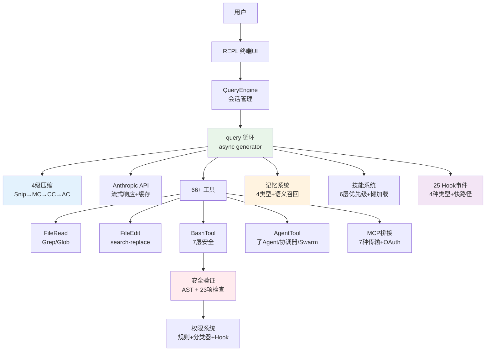

# 10 分钟读懂 Claude Code

> 本文是 Claude Code 源码分析的浓缩版。每个主题都附有深入阅读链接。

无论你是想了解 Claude Code 的内部机制，还是想借鉴它的设计思路来构建自己的 coding agent，这篇文章都会帮你快速建立全局认知。我们不会深入每一行代码，而是聚焦于**关键设计决策**——那些让 Claude Code 从"能用"变成"好用"的工程选择。

## Claude Code 是什么

Claude Code 是 Anthropic 的 CLI 编程 Agent。它不是代码补全工具，而是一个**受控工具循环 Agent**——能理解代码库、编辑文件、执行命令、管理 git 的自主编程助手。

你可能会问：一个 CLI 工具为什么需要 512K+ 行代码？这正是它有趣的地方。Claude Code 解决的不是"如何调用大模型 API"这个简单问题，而是一系列工程挑战：

- **如何让 Agent 自主完成复杂任务？** → Agent Loop 的多轮决策与错误恢复
- **如何在有限的上下文窗口里高效工作？** → 4 级渐进式上下文压缩
- **如何让 AI 安全地执行 Shell 命令？** → 7 层纵深防御 + AST 级命令分析
- **如何让 Agent 跨会话学习？** → 记忆系统 + 技能系统
- **如何处理超出单 Agent 能力的任务？** → 3 种多 Agent 协作模式

这些问题的答案构成了一套完整的 **Agent 工程方法论**——这正是本系列文档想帮你理解的。

> 深入阅读：[概述](./01-overview.md)

---

## 核心：Agent Loop

Agent Loop 是 Claude Code 的灵魂——理解了它，就理解了所有 coding agent 的核心模式。

它本质上是一个 `while(true)` 循环：

```
用户输入 → 组装上下文 → 调用模型 → 模型决策
  ↓
  有工具调用？ → 执行工具 → 注入结果 → 继续循环
  ↓
  无工具调用？ → 返回文本响应 → 结束
```

这个流程看起来简单，但魔鬼在细节里。想象你让 Claude Code "重构这个文件里的所有函数名为 snake_case"——模型会先读取文件（工具调用），分析当前命名（文本推理），然后逐个编辑函数名（多次工具调用），每次编辑后检查是否有遗漏（继续循环），直到确认全部完成才返回结果。整个过程可能循环十几次，但对用户来说只是一条指令。

### 双层架构

实现为 `async function*` 异步生成器，采用双层设计：

- **QueryEngine**（外层）：管理对话生命周期——持久化、预算检查、用户中断。它关心的是"这个对话要不要继续"
- **query()**（内层）：管理单次循环——API 流式、工具执行、错误恢复。它关心的是"这一轮怎么跑完"

为什么要分两层？因为会话管理和查询执行的关注点完全不同。会话层需要处理用户中断、Token 预算耗尽、对话持久化等生命周期问题；而查询层只需要专注于"调 API → 解析响应 → 执行工具 → 拼装结果"这个紧凑循环。分层让每一层的逻辑都保持清晰。

### 自动错误恢复

query() 有 **7 个 Continue Sites**，每种对应一种故障恢复路径——这就是为什么用 Claude Code 时很少遇到报错：

- 模型输出被截断？→ 自动用更高的 Token 限制重试
- 上下文快满了？→ 触发压缩后继续
- API 返回错误？→ 按退避策略重试

核心设计原则是**错误扣留**——可恢复的错误不暴露给调用者，自动修复后继续。Agent 应该像一个靠谱的同事，遇到小问题自己解决，而不是每次都来问你。

### 流式并行执行

- **工具预执行**——模型还在生成输出时，已完成解析的工具调用就立即开始执行，把约 1 秒的工具延迟藏在模型生成的 5-30 秒窗口里。用户感受到的是工具"瞬间完成"
- **StreamingToolExecutor**——边流式解析边并发执行，只读工具自动并行。当模型同时调用多个只读工具（比如同时读三个文件），它们会并发执行而不是排队等待

> 深入阅读：[系统主循环](./02-agent-loop.md)

---

## 上下文工程

如果说 Agent Loop 是 Claude Code 的骨架，那上下文工程就是它的血液。大模型的能力完全取决于它"看到了什么"——同样的模型，给它精心组织的上下文和随意堆砌的上下文，表现可能天差地别。

### 上下文三层结构

每次 API 调用的上下文由三部分组成：

1. **系统提示词**（最稳定，缓存效率最高）：Agent 身份、行为指引、工具描述
2. **系统/用户上下文**（会话级稳定）：Git 状态、CLAUDE.md 项目指令、当前日期
3. **消息历史**（最易变）：对话记录、工具调用结果

### 4 级压缩流水线

上下文窗口是有限的。一个复杂的编程任务可能需要几十轮对话，每轮都会产生新的消息、工具调用结果、文件内容——上下文很快就会被撑满。Claude Code 的解决方案是一条从轻量到激进逐级启动的压缩流水线：

```
Snip（剪裁）→ Microcompact（微压缩）→ Context Collapse（折叠）→ Autocompact（全量摘要）
```

- **Snip**：把大块工具输出替换成占位符——最轻量，几乎无信息损失
- **Microcompact**：对工具结果做局部压缩——保留关键信息，去掉冗余
- **Context Collapse**：把整段对话折叠成摘要——显著释放空间
- **Autocompact**：最后手段，在 Token 使用达到约 87% 时触发，fork 一个子 Agent 来生成结构化摘要

每一级都比上一级"丢失"更多细节，但也释放更多空间——系统会尽可能用最轻量的方式解决问题。

### 压缩后恢复

压缩不只是删信息，还会主动恢复关键上下文。想象你让 Claude Code 编辑五个文件，编辑到第三个时上下文被压缩了，前面读过的文件内容被删除了。如果不做任何处理，模型可能忘记前两个文件的修改细节。所以系统会：

- 自动重新读取最近编辑的 **5 个文件**（每个 ≤5K tokens）
- 重新激活活跃的技能上下文（≤25K tokens）
- 重置 Context Collapse 标记

### 提示词缓存

每次 API 调用都要发送完整上下文，但大部分内容在相邻调用之间是不变的。通过缓存断点标记让 API 服务端复用已处理的前缀，显著降低延迟和成本。系统还能自动检测缓存断裂（cache miss 率突增），归因到是 CLAUDE.md 变更、对话压缩还是工具结果过大导致的。

> 深入阅读：[上下文工程](./03-context-engineering.md)

---

## 工具系统

工具是 Agent 与真实世界交互的手段。没有工具，大模型只能生成文字；有了工具，它才能真正地读文件、写代码、跑测试。

### 统一工具接口

Claude Code 包含 **66+ 内置工具**，全部统一为 `Tool` 接口。核心设计是 **fail-closed 默认值**——新工具如果不显式声明安全属性，默认被当作不安全处理。这意味着遗漏声明不会导致安全漏洞，只会导致功能受限。

| 核心工具 | 功能 |
|---------|------|
| BashTool | Shell 命令执行（最复杂，7 层安全验证） |
| FileEditTool | search-and-replace 精确编辑 |
| FileReadTool | 文件读取（支持图片/PDF/Jupyter） |
| GrepTool | ripgrep 驱动的内容搜索 |
| AgentTool | 派生子 Agent（支持 worktree 隔离） |

### 并发与执行

并发规则遵循一个简单原则：**只读工具并行，写入工具串行**。通过 `isReadOnly()` 和 `isConcurrencySafe()` 两个方法声明式地判断——模型可以同时读三个文件而不冲突，但写入操作会严格排队。

工具执行遵循 **8 阶段管道**：查找 → 校验 → 并行启动 → 权限检查 → 执行 → 结果处理 → 后置 Hook → 事件发射。当工具输出超过 100K 字符时自动落盘到临时文件，模型只拿到摘要和文件路径，避免超大输出撑爆上下文。

### MCP 集成

MCP（Model Context Protocol）让 Claude Code 不再是一个封闭系统。通过 MCP，第三方开发者可以为 Claude Code 添加任意能力——连接数据库、调用内部 API、操作 Kubernetes 集群——而无需修改 Claude Code 本身的代码。MCP 工具和内置工具遵循同一套权限检查、输入校验、并发控制的规则。

> 深入阅读：[工具系统](./04-tool-system.md)

---

## 代码编辑策略

代码编辑是 coding agent 最核心也最危险的能力。一个常见做法是让模型生成整个文件然后覆盖写入，但这在实际项目中问题很大：一个 500 行的文件，模型可能只需要改 3 行，但全文件重写意味着它需要完美复现其余 497 行——任何遗漏都会引入 bug。

Claude Code 选择了 **search-and-replace 策略**，这不只是一种编辑方式，而是一个深思熟虑的设计决策：

- **位置无关**：不依赖行号，文件被修改后不会错位——行号方案在多轮编辑中极易出错
- **抗幻觉**：`old_string` 必须精确匹配且在文件中唯一，不存在的代码会导致编辑失败而非静默写入
- **Token 高效**：只需发送修改点附近的上下文，而不是整个文件
- **Git 友好**：产生最小精确 diff，便于 code review

编辑前必须先读取文件——这不是提示词里的建议，而是代码层面的强制检查（`hasReadFileInSession` 标志位）。模型如果试图编辑一个它还没读过的文件，工具会直接拒绝执行。

编辑验证经过 **14 步校验管道**：文件存在性、编码检测、权限检查、配置文件安全、引号规范化（自动转换弯引号为直引号）、唯一性约束等。

> 深入阅读：[代码编辑策略](./05-code-editing-strategy.md)

---

## 权限与安全

一个能执行任意 Shell 命令、读写任意文件的 AI Agent，如果没有严格的安全控制，就是一颗定时炸弹。Claude Code 采用**纵深防御**策略，7 层保护层层递进，每层使用不同技术（正则、AST 解析、ML 分类、人工判断），确保单点故障不会击穿整个防线：

```
Trust Dialog → 权限模式 → 规则匹配 → Bash AST 分析 → 工具级校验 → 沙箱隔离 → 用户确认
```

### Bash 安全验证

整个系统中最复杂的部分——使用 tree-sitter 对命令进行 AST 级别的分析，加上 23 项静态检查，覆盖命令注入、环境变量泄露、Shell 元字符等攻击向量。它不是简单的黑名单匹配，而是真正"理解"命令的结构。

### 权限决策竞速

权限确认使用**竞速机制**：UI 对话框、Hook 和 ML 分类器同时运行，第一个完成的决定生效。对于明显安全的操作（分类器快速判定），用户不需要等待；需要人工判断的操作，UI 对话框会弹出。用户交互始终优先于自动结果。有 200ms 防误触宽限期。

### 权限规则系统

支持三种匹配模式（精确匹配、前缀 `:*`、通配符 `*`），规则可在项目级、用户级分别配置。**拒绝规则永远优先**——即使在最宽松的权限模式下，deny 规则也会生效。

PermissionRequest Hook 是最强的扩展点——企业团队可以实现自定义审批逻辑，比如"所有 `git push` 必须经过团队 lead 审批"或"自动给 `rm` 加 `--dry-run`"。

> 深入阅读：[权限与安全](./11-permission-security.md)

---

## Hooks 与可扩展性

每个团队都有自己的工作流。Hook 系统让用户**不修改源码就能定制 Agent 的行为**。

Claude Code 提供 **25 种 Hook 事件**，覆盖 Agent 完整生命周期（工具调用前后、权限判定、会话管理、压缩等）。

**四种 Hook 类型**覆盖从简单脚本到企业服务的所有场景：

| Hook 类型 | 适用场景 | 示例 |
|-----------|---------|------|
| Command | 简单 Shell 命令 | CI 构建检查、日志记录 |
| Prompt | 需要 AI 处理的逻辑 | 自定义 Linter 反馈 |
| Agent | 复杂多步决策 | 安全审计流程 |
| HTTP | 企业 HTTP 服务集成 | 团队审批系统 |

Hook 执行引擎有关键的**快路径优化**：当所有匹配的 Hook 都是 callback/function 类型时，框架跳过 JSON 序列化和进度事件，延迟降低约 70%。

> 深入阅读：[Hooks 与可扩展性](./06-hooks-extensibility.md)

---

## 多 Agent 架构

单个 Agent 在处理简单任务时游刃有余，但面对大型项目——比如"重构这个微服务的 API 层并更新所有调用方"——单 Agent 就会遇到瓶颈：上下文窗口不够用、任务太复杂、或者多个文件的修改需要并行进行。

Claude Code 支持三种多 Agent 模式：

### 子 Agent 模式

最常用。通过 AgentTool fork 出独立子任务，每个子 Agent 有自己的上下文窗口和工具集。关键设计：

- **上下文隔离**：子 Agent **不继承父对话历史**，只接收自包含的任务描述。这确保了隔离性和成本可控
- **工具过滤**：4 层过滤管道（移除元工具 → 自定义限制 → 异步白名单 → Agent 级禁止列表），不同类型的子 Agent 获得不同的工具集
- **Git Worktree 隔离**：每个子 Agent 可以获得独立的代码副本，多 Agent 同时编辑不同文件不会冲突
- **3 种内置类型**：Explore（只读，用 Haiku 模型降低成本）、Plan（只读，结构化输出）、General-purpose（完整工具集）

### 协调器模式（Coordinator）

纯指挥官——**只能分配任务，不能自己读文件、写代码**。这个设计看似限制，实际上防止了协调器"顺手"做本该交给 worker 的事情，确保职责清晰。标准 4 阶段工作流：研究 → 综合 → 实施 → 验证。

### Swarm 团队模式

最灵活也最复杂。命名 Agent 间通过对等信箱通信，不需要中央协调器。适合多个 Agent 长时间并行工作的场景。

> 深入阅读：[多 Agent 架构](./07-multi-agent.md)

---

## 记忆与技能系统

### 记忆系统

你有没有这样的经历：每次开新会话都要重新告诉 AI"这个项目用的是 monorepo"、"测试框架用 Vitest 不要用 Jest"？这就是缺乏跨会话记忆的痛点。

Claude Code 的记忆系统是一个有结构、有分类、有智能召回的知识库：

- **4 种封闭记忆类型**：user（用户画像）、feedback（行为校正）、project（项目上下文）、reference（外部资源指针）。封闭分类防止标签膨胀
- **语义召回**：不是关键词匹配，而是用 Sonnet 模型评估每条记忆与当前任务的相关性
- **明确的"不记什么"**：代码模式、git 历史、已有文档里的内容——这些可以从当前项目状态推导出来，记下来只会变成过时信息
- **与 CLAUDE.md 互补**：CLAUDE.md 是团队共享的项目规则（签入 git），记忆是个人的跨会话学习（本地存储）

### 技能系统

如果说记忆是 Agent 的"长期知识"，技能就是它的"可复用能力"——可以理解为"AI Shell 脚本"。

- 用户可通过 `/commit` 这样的斜杠命令手动调用，模型也可以根据上下文自动触发（用户说"帮我提交"时，模型判断应该调用 commit 技能）
- **6 层优先级加载**（托管 > 项目 > 用户 > 插件 > 内置 > MCP），团队可在项目级别定义共享技能，个人用户可以覆盖或扩展
- **懒加载**：注册时只读 frontmatter 元数据，技能内容在真正调用时才加载，保持启动速度
- **Token 预算分配**：3 阶段算法——全量描述 → 分区描述（内置技能保留完整，其余共享剩余） → 仅名称。确保技能列表不会挤占上下文空间

> 深入阅读：[记忆系统](./08-memory-system.md) | [技能系统](./09-skills-system.md)

---

## 从最小到完整

看完上面的介绍，你可能觉得构建一个 coding agent 是一件非常复杂的事。但好消息是：**核心概念其实很简单**。一个最小可用的 coding agent 只需要 7 个组件：

1. **Prompt Orchestration** — 运行时组装环境信息 + git 上下文 + 项目规则
2. **Tool Registry** — JSON Schema 声明 + switch/case 分发
3. **Agent Loop** — async generator 状态机，循环直到模型不再调用工具
4. **File Operations** — 读文件、搜索文件
5. **Shell Execution** — 执行命令、捕获输出
6. **Edit Strategy** — search-and-replace 精确编辑
7. **CLI UX** — readline 交互、流式输出

~3000 行代码就能实现一个可运行的最小版本（含记忆、技能、多 Agent 等进阶能力）。Claude Code 的 512K+ 行覆盖了生产级需求：Hooks 系统、Coordinator/Swarm 多 Agent 模式、MCP 集成、OAuth 认证等。从 3000 行到 512K 行的差距，就是"功能完整"和"企业级生产"之间的工程距离。

如果你想动手实践，可以跟着我们的分步教程从零构建：[claude-code-from-scratch](https://github.com/Windy3f3f3f3f/claude-code-from-scratch)

> 深入阅读：[最小必要组件](./13-minimal-components.md)

---

## 核心架构图

下图展示了 Claude Code 各模块的关系。Agent Loop（绿色）是整个系统的枢纽，连接着上下文压缩（蓝色）、安全系统（红色）、记忆系统（橙色）和 Hook 系统（紫色）：



## 关键文件索引

| 文件 | 行数 | 职责 |
|------|------|------|
| `src/query.ts` | 1,728 | 核心查询循环 |
| `src/QueryEngine.ts` | 1,155 | 会话引擎 |
| `src/Tool.ts` | ~400 | 工具接口定义 |
| `src/tools.ts` | ~200 | 工具注册 |
| `src/context.ts` | 190 | 上下文构建 |
| `src/services/api/claude.ts` | 3,419 | API 调用逻辑 |
| `src/services/compact/compact.ts` | 1,705 | 压缩引擎 |
| `src/hooks/` | — | Hook 执行引擎与权限处理 |
| `src/coordinator/` | — | 多 Agent 协调器 |
| `src/memdir/` | — | 记忆系统 |
| `src/skills/` | — | 技能系统 |

---

*本文档基于 Claude Code 源码分析。完整分析文档见项目根目录。*

*项目地址：[how-claude-code-works](https://github.com/Windy3f3f3f3f/how-claude-code-works) | [claude-code-from-scratch](https://github.com/Windy3f3f3f3f/claude-code-from-scratch)*
